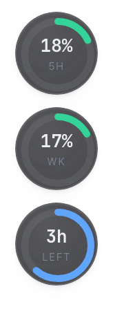
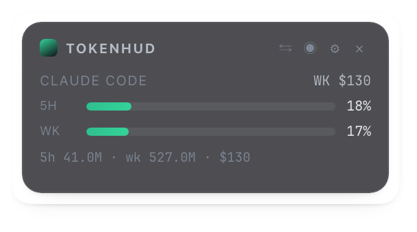
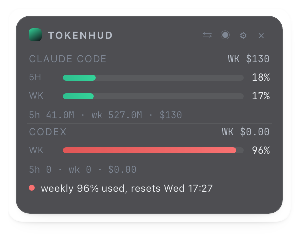

# TokenHUD

A small always-on-top overlay that shows how much of your AI coding-CLI budget
you've used — this hour, the trailing 5 hours, and this week — for **Claude Code**,
**Codex CLI**, and (opt-in) **Cursor** / **GitHub Copilot**.

It is **passive**: it only reads local log files those tools already write. It
never sends prompts and never spends tokens. The one exception is the opt-in
weekly summary, which calls the Anthropic API with aggregate counts only (never
transcript content) and is off unless you add a key.

## Views

<table>
<tr>
<td align="center" width="200">
<br>
<sub><b>Circle mode</b> (default) — 5h %, weekly %, and time left in the 5h block; click-through, pinned to the edge</sub>
</td>
<td align="center">
<br>
<sub><b>Card mode</b> — authoritative 5h / weekly plan %, cost, breakdown</sub>
</td>
<td align="center">
<br>
<sub><b>Multiple tools</b> — Claude Code + Codex, with advisories</sub>
</td>
</tr>
</table>

Toggle between views from the tray, the `◉` button on the card header, or by
right-clicking the HUD. The gear opens a settings window for plan caps, the
opt-in cloud tokens, and the weekly-summary key.

## How it works

| Tool | Source | Notes |
|------|--------|-------|
| Claude Code | `~/.claude/projects/**/*.jsonl` + the desktop app's `plan-usage-history.json` | Token counts and cost from the transcripts (deduped by message id + request id, matches `ccusage` within ~0.2%). The **authoritative 5-hour and weekly plan percentages** — the same figures the Claude desktop app shows — come from `plan-usage-history.json`. If you only use the CLI (no desktop app) that file is absent; set caps in Settings for estimated percentages instead. The **time left in the 5h block** is derived from `plan-usage-history.json` (the current window began where `fh` last dropped to ~0); if that file is absent it falls back to estimating 5h from your first message of the current activity block. |
| Codex CLI | `~/.codex/{sessions,archived_sessions}/rollout-*.jsonl` | Token deltas **and** Codex's own reported rate-limit percentages, which are authoritative. |
| Gemini CLI | — | Stub: its local logs carry no token counts. |
| Cursor | `cursor.com` dashboard API | Opt-in; needs a session token. Billed in requests. |
| Copilot | GitHub API | Opt-in; needs a token. Flat plan with quotas. |

## Build & run

Requires a Rust toolchain. No Node/npm — the HUD is a static page in `dist/`.

```bash
# CLI (text output; good for a sanity check)
cargo run -p tokenhud-core --bin tokenhud
cargo run -p tokenhud-core --bin tokenhud -- --watch
cargo run -p tokenhud-core --bin tokenhud -- summary   # needs [summary] key

# The overlay
cargo run -p tokenhud-hud
```

For a packaged build, install the Tauri CLI (`cargo install tauri-cli --version '^2'`)
and run `cargo tauri build`, or push a `v*` tag to trigger `.github/workflows/release.yml`
(add Apple signing secrets to notarize the macOS build).

## Tests

```bash
cargo test --workspace                 # ~100 unit + integration tests
cargo clippy --workspace --all-targets  # lint (CI runs with -D warnings)
bash docs/gen-screenshots.sh            # renders the real UI headless,
                                        # asserts the DOM, refreshes docs/*.png
```

The core logic (parsers, store, windows, cost, advisories, 5h-reset) and the
overlay's geometry + notification thresholds are covered in Rust; the frontend
view-model lives in `dist/hud.mjs` and is checked by the screenshot script's
render assertions.

## Config

`~/Library/Application Support/dev.tokenhud.tokenhud/config.toml`
(platform config dir elsewhere). Everything is optional.

```toml
[caps.claude]
hour   = 3000000
five_h = 12000000
week   = 60000000

[cloud]
cursor_token = ""
github_token = ""

[summary]
anthropic_api_key = ""
model = "claude-haiku-4-5-20251001"
```

Caps can also be edited from the HUD's gear icon.

## Platform notes

- Starts in **circle mode** on the right edge (two rings: 5h + weekly). The rings
  are **click-through** — clicks pass to whatever's behind them. Right-click the
  rings for the menu (switch to card, move side, settings, …); on macOS that needs
  Accessibility permission (System Settings › Privacy & Security › Accessibility),
  otherwise use the tray icon. Card mode is a normal interactive window.
- **macOS** — runs as an accessory (no Dock icon); tray icon + `⌘⇧T` toggle.
- **Windows** — `WS_EX_NOACTIVATE | WS_EX_TOOLWINDOW` so it never steals focus.
- **Linux** — X11 works; on Wayland always-on-top is unreliable, so use the tray.

## Layout

```
core/       tokenhud-core lib + `tokenhud` CLI
  providers/   one module per tool behind a UsageProvider trait
  store.rs     SQLite event log (dedup by primary key)
  aggregate.rs rolling windows + cost + cap ratios
  advisor.rs   burn-rate / projected-exhaustion advisories
src-tauri/  the overlay app (tray, shortcut, notifications, settings window)
dist/       the HUD and settings HTML
```
